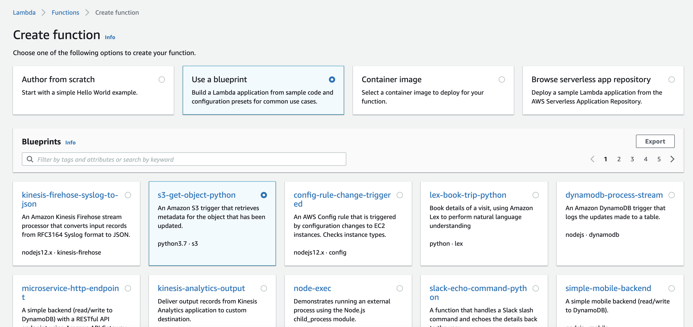

# r7insight_lambdaS3
Follow the instructions below to send logs stored on AWS S3 to Rapid 7.

###### Example use cases:
* Forwarding AWS ELB and CloudFront logs
  * (make sure to set ELB/CloudFront to write logs every 5 minutes)
  * When forwarding these logs, the script will format the log lines according to Rapid 7 KVP or JSON spec to make them easier to analyze
* Forwarding OpenDNS logs

## Obtain log token
1. Log in to your Rapid 7 account

2. Add a new [token based log](https://insightops.help.rapid7.com/docs/token-tcp)

## Deploy the script to AWS Lambda using AWS Console
1. Create a new Lambda function

2. Choose the appropriate Python blueprint for S3 objects

   

3. Configure function:
   * Give your function a name
   * Assign or create a new role that is allowing GetObject on necessary s3 bucket(s).
   Note: Creating a new one automatically from this UI adds required permissions automatically`
   
4. Configure triggers:
   * Choose the bucket log files are being stored in
   * Set event type "All object create events"

5. Click "Create function"

6. Upload function code:
   * Create a .ZIP file, containing ```r7insight_lambdas3.py``` and the folder ```certifi```
     * Make sure the files and ```certifi``` folder are in the **root** of the ZIP archive
   * Go to "Code source" section of lambda setup
   * Choose ".zip file" in "Upload from" dropdown and upload the archive created in previous step
   * Set Python runtime version to ```Python 3.9``` by editing "Runtime settings" section 
   * Set handler name to ```r7insight_lambdas3.lambda_handler```
   
   Working example file structure:
   ```
    (root) - current AWS sets root directory name to your lambda function name automatically
    ├── certifi/
    │   ├── 
    │   ├── __init__.py
    │   ├── __main__.py
    │   ├── cacert.pem
    │   ├── core.py
    │   ├── old_root.pem
    │   └── weak.pem
    ├── r7insight_lambdas3.py`
    ``
   
   `Note: Zip files downloaded via github puts all the files under a subdirectory; thefore, uploading the downloaded zip directly to AWS will not work.`

7. Select configuration tab, edit "General configuration" to change memory and timeout limits

8. Add the following Environment Variables:
   * Token value should match UUID provided by Rapid 7 UI or API
   * Region should be that of your R7 account

   | Key       | Value                       |
   |-----------|-----------------------------|
   | region    | InsightOps region(eu,us etc)|
   | token     | Token UUID                  |

## Gotchas
   * The "Test" execution in AWS Lambda will **ALWAYS** fail as the test event does not refer to an existing S3 object. In order to verify, upload a sample file to source bucket


## 3rd party dependencies
   * [python-certifi](https://github.com/certifi/python-certifi)
